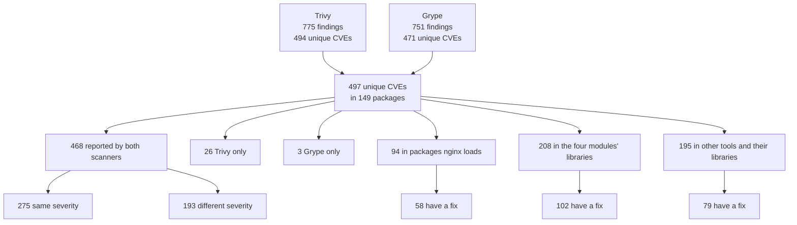
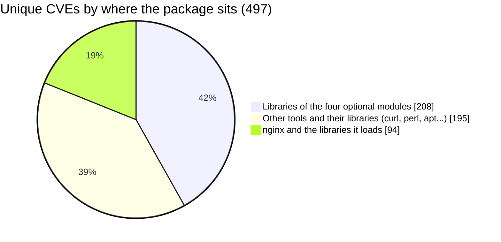
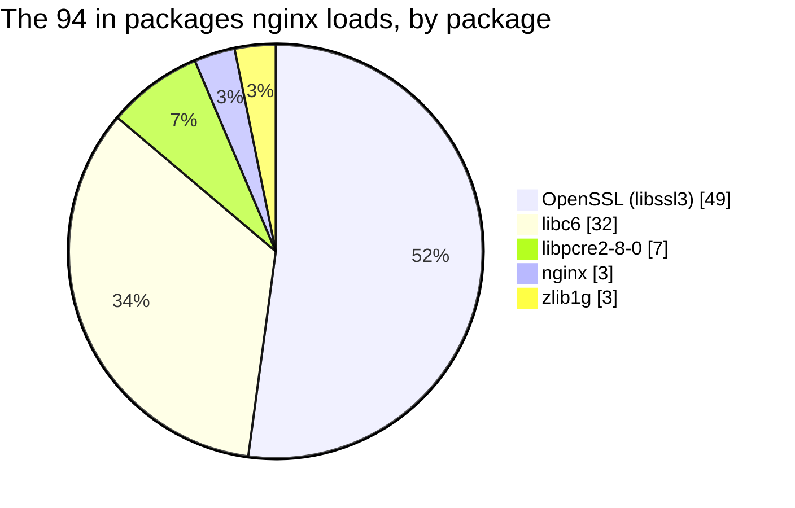
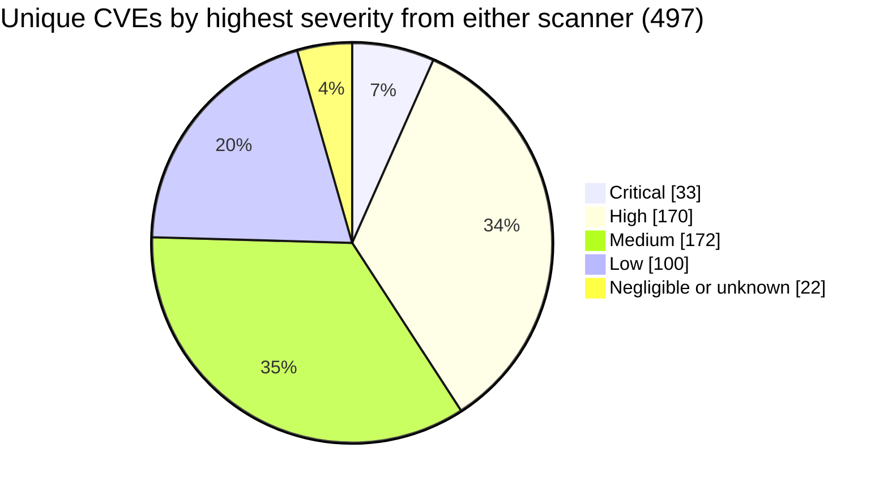
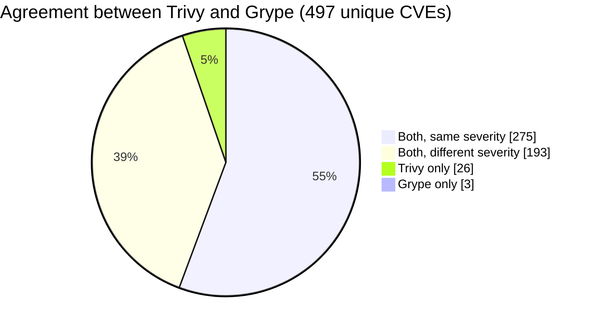
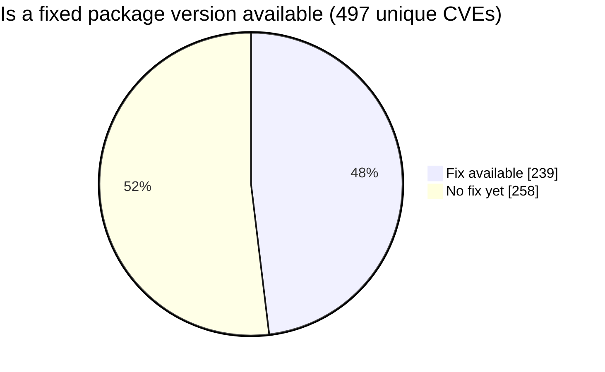

# Baseline: the original image, before any change

Everything in this folder describes the untouched `nginx:1.25-bookworm` image. It is
the "before" picture that the patched image is compared with.

- **Image:** nginx 1.25.5 on Debian 12.5, linux/amd64,
  `nginx@sha256:a484819eb60211f5299034ac80f6a681b06f89e65866ce91f356ed7c72af059c`
- **Scanned:** 2026-10-04 with Trivy 0.75.0 and Grype 0.120.0
- **How to regenerate:** `make scan-baseline` writes every file except the two triage
  files, and `make triage` writes those. Do not edit these files by hand.

## The files

### Scan reports: what is vulnerable

| File | What it is | Used for |
|---|---|---|
| `trivy.json` | Trivy's full report, machine-readable | Input for `make triage` and for the before/after diff |
| `trivy.txt` | The same report as a table for people to read | Looking up a CVE or a package by eye |
| `grype.json` | Grype's full report, machine-readable | Input for `make triage` and for the before/after diff |
| `grype.txt` | The same report as a table | Looking up a CVE or a package by eye |

Two scanners are used because they draw on different data and disagree. Trivy reports
775 findings (494 unique CVEs), Grype 751 (471 unique).

### Triage: the two reports merged and ranked

| File | What it is | Used for |
|---|---|---|
| `triage.md` | Summary counts and the top 40 vulnerabilities | Choosing which CVEs to fix |
| `triage.csv` | Every one of the 497 unique vulnerabilities, ranked, one per row | Counting and filtering, for example by package |

Each vulnerability gets a score: how dangerous it is (real-world exploitation and
severity) multiplied by how far it reaches (whether nginx itself runs the affected
code). The method is described in `scripts/CLAUDE.md` and at the top of
`scripts/compare-scans.py`.

### Image metadata: how the original is put together

These are not scan results. They record what the original looks like, so the patched
image can be made to match it.

| File | What it is | Produced by | Used for |
|---|---|---|---|
| `inspect.json` | The image's settings: entrypoint, command, port, environment variables, labels, stop signal | `docker inspect` | Copying the same settings into the `Containerfile` |
| `history.txt` | The commands that were run to build the original image, layer by layer | `docker history --no-trunc` | Seeing how nginx and its modules were installed, and what the `Containerfile` must reproduce |
| `nginx-V.txt` | nginx's version and the options it was compiled with | `nginx -V` inside the image | Compiling the patched nginx with identical options, so files land in the same places |
| `packages.tsv` | All 149 installed packages: name, version, source package | `dpkg-query` inside the image | Knowing which versions are vulnerable and comparing with the new image |
| `layout.txt` | Directory listings of `/`, `/docker-entrypoint.d`, `/etc/nginx`, `/etc/nginx/conf.d` and the modules folder, plus the `nginx` user's IDs | `ls` and `id` inside the image | Checking the patched image has the same files, permissions and user |
| `linked-packages.txt` | The `nginx` package and the five library packages its program loads | `ldd /usr/sbin/nginx` inside the image | Telling "nginx runs this code" apart from "this only sits in the image" in the triage score |

### Provenance: exactly what was scanned

| File | What it is | Used for |
|---|---|---|
| `digest.txt` | The image's unique fingerprint (digest) and platform | Proving which exact image these results belong to; the tag `1.25-bookworm` alone could point to a different build later |
| `versions.txt` | Scan date, image digest, and the scanner versions | Making a later scan comparable: same tools, known date |

## Key numbers

| | Value |
|---|---|
| Installed packages | 149 (Trivy counts 144 of them) |
| Unique vulnerabilities, both scanners together | 497 |
| Reported by both scanners | 468 |
| Critical or High in at least one scanner | 203 |
| In packages nginx itself loads | 94 |

## The numbers as diagrams

All counts are unique CVEs from `triage.csv` unless a diagram says "findings". GitHub
renders these diagrams; in a plain text editor they appear as code.

### How the 497 break down

### Where the vulnerabilities live

Only the smallest slice is code that every running container executes.

### How severe

The two scanners rate the same image differently (counts of findings, not unique CVEs):

| Severity | Trivy | Grype |
|---|---|---|
| Critical | 20 | 47 |
| High | 181 | 253 |
| Medium | 316 | 265 |
| Low | 234 | 39 |
| Negligible | 0 | 128 |
| Unknown | 24 | 19 |
| **Total findings** | **775** | **751** |

### Do the scanners agree

15 CVEs are Critical in both scanners.

### Can it be fixed by updating

### How likely to be exploited

| Signal | Unique CVEs |
|---|---|
| On CISA's known-exploited list (KEV) | 2 (CVE-2023-44487 in `nginx`, CVE-2025-27363 in `libfreetype6`) |
| EPSS of 10% or more | 12 |
| EPSS of 1% or more | 93 |
| EPSS below 1% | 404 |

### The four optional modules

Counts overlap where two modules share a library; together they account for 208.

| Module | Libraries it brings in | CVEs in them | Critical or High |
|---|---|---|---|
| image-filter | 32 | 166 | 65 |
| xslt | 3 | 42 | 23 |
| njs | 4 | 34 | 20 |
| geoip | 1 | 0 | 0 |

### Packages with the most CVEs

| Package | Unique CVEs | Loaded by nginx |
|---|---|---|
| `libssl3` / `openssl` | 49 | Yes |
| `libheif1` | 45 | No (image-filter) |
| `curl` / `libcurl4` | 40 | No |
| `libexpat1` | 35 | No (image-filter) |
| `libxml2` | 33 | No (xslt, njs) |
| `libtiff6` | 33 | No (image-filter) |
| `libc6` / `libc-bin` | 32 | Yes |
| `libgnutls30` | 22 | No |
| `perl-base` | 21 | No |

## Things to know when reading these files

- The scanners only compare package names and versions with a database. They do not
  look at the code.
- nginx's own CVEs are mostly missing, because the nginx package comes from nginx.org
  and is compared with Debian's version numbers. See the main `README.md`.
- The path `/home/claude/scaleops-mission/...` inside the reports is where the image
  file was on the machine that ran the scan. It has no other meaning.
- `linked-packages.txt` was added on 2026-10-05, a day after the other files, from the
  same image.
