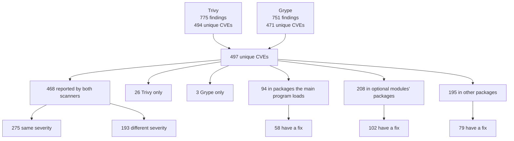
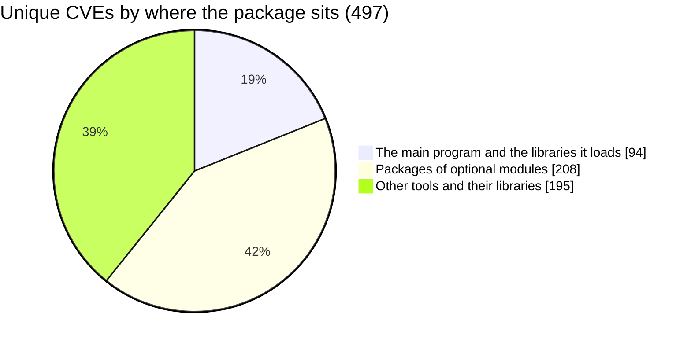
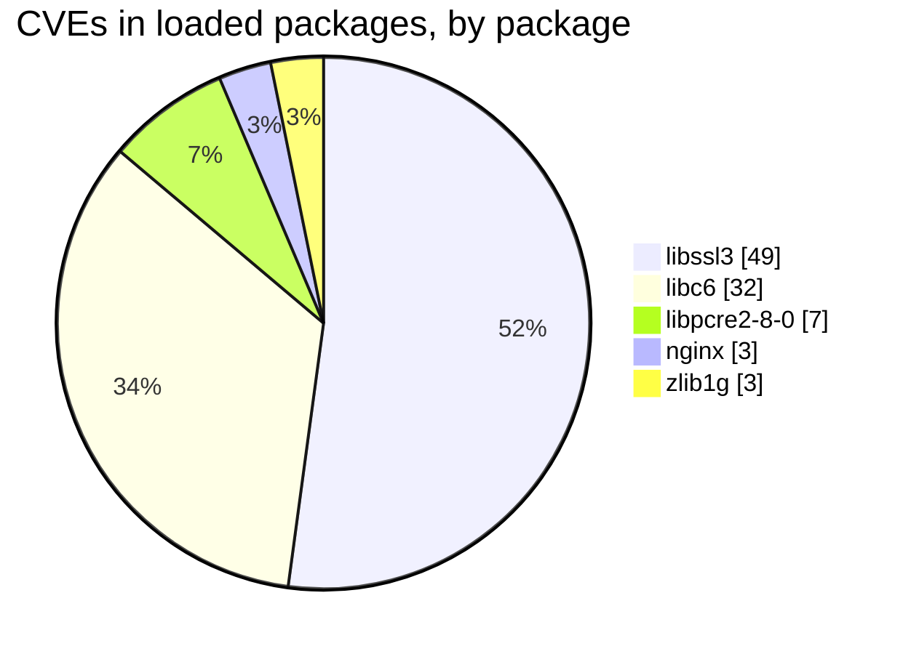
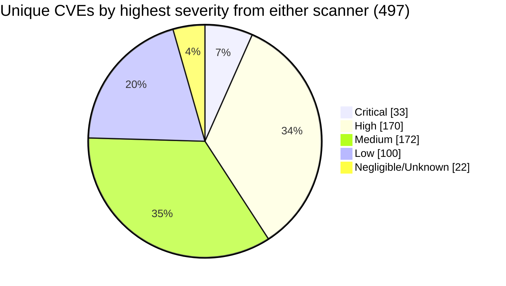
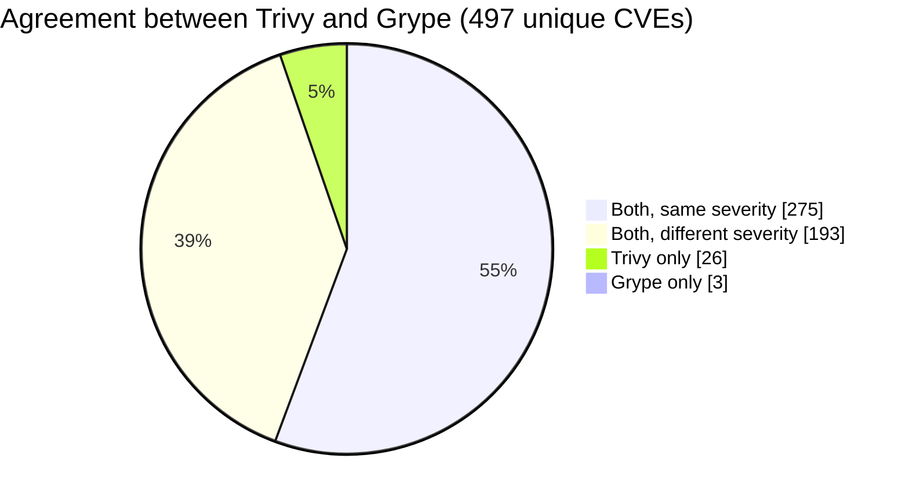
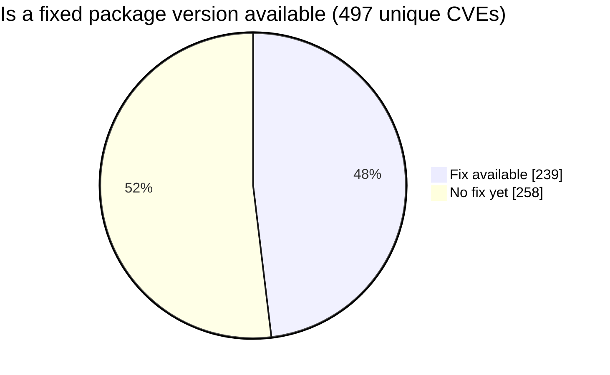

# Scan statistics

Generated by `scripts/compare-scans.py` from `trivy.json` and `grype.json`. Do not edit by
hand; rerun the script. Counts are unique CVEs unless a line says "findings". GitHub
renders the diagrams; in a plain text editor they appear as code.

## How the 497 break down

## Where the vulnerabilities live

## How severe

Findings per scanner (the same CVE in two packages counts twice):

| Severity | Trivy | Grype |
|---|---|---|
| Critical | 20 | 47 |
| High | 181 | 253 |
| Medium | 316 | 265 |
| Low | 234 | 39 |
| Negligible | 0 | 128 |
| Unknown | 24 | 19 |
| **Total findings** | **775** | **751** |

## Do the scanners agree

15 CVEs are Critical in both scanners.

## Can it be fixed by updating

## How likely to be exploited

| Signal | Unique CVEs |
|---|---|
| On CISA's known-exploited list (KEV) | 2 (CVE-2023-44487 in `nginx`, CVE-2025-27363 in `libfreetype6`) |
| EPSS of 10% or more | 12 |
| EPSS of 1% or more | 93 |
| EPSS below 1% | 404 |

## Optional modules

Packages installed only because of each module. Counts overlap where two
modules share a package; together they account for 208.

| Module | Packages it brings in | CVEs in them | Critical or High | With a fix |
|---|---|---|---|---|
| `nginx-module-image-filter` | 32 | 166 | 65 | 75 |
| `nginx-module-xslt` | 3 | 42 | 23 | 27 |
| `nginx-module-njs` | 4 | 34 | 20 | 22 |
| `nginx-module-geoip` | 1 | 0 | 0 | 0 |

## Packages with the most CVEs

| Package | Unique CVEs | Critical or High | Loaded by the main program |
|---|---|---|---|
| `libssl3` | 49 | 25 | Yes |
| `openssl` | 49 | 25 | No |
| `libheif1` | 45 | 18 | No |
| `curl` | 40 | 16 | No |
| `libcurl4` | 40 | 16 | No |
| `libexpat1` | 35 | 13 | No |
| `libtiff6` | 33 | 8 | No |
| `libxml2` | 33 | 19 | No |
| `libc-bin` | 32 | 10 | No |
| `libc6` | 32 | 10 | Yes |
| `libgnutls30` | 22 | 11 | No |
| `perl-base` | 21 | 14 | No |
