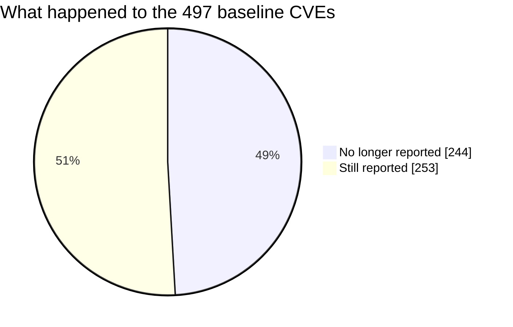

# Patched image compared with the baseline

Generated by `scripts/diff-scans.py` from `scans/baseline` and `scans/patched`. Do not edit
by hand; rerun the script. Counts are unique CVE IDs across Trivy and Grype. Full list:
`diff.csv`.

## Before and after

| Image | Packages | Unique CVEs | Critical or High | Critical in both | Known exploited | In loaded packages |
|---|---|---|---|---|---|---|
| Baseline | 149 | 497 | 203 | 15 | 2 | 94 |
| Patched | 149 | 253 | 80 | 2 | 1 | 36 |

- **244** baseline CVEs are no longer reported.
- **253** are still reported (0 of them have a fixed version available).
- **0** are reported now but were not in the baseline.

| Highest severity | No longer reported | Still reported | New |
|---|---|---|---|
| Critical | 17 | 16 | 0 |
| High | 107 | 64 | 0 |
| Medium | 99 | 71 | 0 |
| Low | 13 | 88 | 0 |
| Negligible/Unknown | 8 | 14 | 0 |

## Package versions that changed

66 packages changed version, 0 were removed, 0 were added.

| Package | Before | After | Loaded by nginx | Baseline CVEs no longer reported |
|---|---|---|---|---|
| `libc6` | 2.36-9+deb12u7 | 2.36-9+deb12u14 | yes | 9 |
| `libpcre2-8-0` | 10.42-1 | 10.42-1+deb12u2 | yes | 7 |
| `libssl3` | 3.0.11-1~deb12u2 | 3.0.22-1~deb12u1 | yes | 42 |
| `openssl` | 3.0.11-1~deb12u2 | 3.0.22-1~deb12u1 | no | 42 |
| `libexpat1` | 2.5.0-1 | 2.5.0-1+deb12u4 | no | 30 |
| `libxml2` | 2.9.14+dfsg-1.3~deb12u1 | 2.9.14+dfsg-1.3~deb12u6 | no | 24 |
| `libgnutls30` | 3.7.9-2+deb12u2 | 3.7.9-2+deb12u7 | no | 21 |
| `curl` | 7.88.1-10+deb12u5 | 7.88.1-10+deb12u15 | no | 14 |
| `libcurl4` | 7.88.1-10+deb12u5 | 7.88.1-10+deb12u15 | no | 14 |
| `libde265-0` | 1.0.11-1+deb12u2 | 1.0.11-1+deb12u3 | no | 14 |
| `libpng16-16` | 1.6.39-2 | 1.6.39-2+deb12u6 | no | 11 |
| `libtiff6` | 4.5.0-6+deb12u1 | 4.5.0-6+deb12u4 | no | 9 |
| `libc-bin` | 2.36-9+deb12u7 | 2.36-9+deb12u14 | no | 9 |
| `libgssapi-krb5-2` | 1.20.1-2+deb12u1 | 1.20.1-2+deb12u5 | no | 7 |
| `libk5crypto3` | 1.20.1-2+deb12u1 | 1.20.1-2+deb12u5 | no | 7 |

## No longer reported (244)

Ranked by their baseline danger-and-reach score.

| ID | Trivy | Grype | Packages | Loaded | Fix available | KEV |
|---|---|---|---|---|---|---|
| CVE-2024-6119 | High | High | libssl3, openssl | yes | yes |  |
| CVE-2024-2511 | Low | Medium | libssl3, openssl | yes | yes |  |
| CVE-2025-7424 | High | High | libxslt1.1 | no | yes |  |
| CVE-2025-27113 | High | High | libxml2 | no | yes |  |
| CVE-2026-25646 | High | High | libpng16-16 | no | yes |  |
| CVE-2025-64720 | High | High | libpng16-16 | no | yes |  |
| CVE-2025-24928 | High | High | libxml2 | no | yes |  |
| CVE-2025-66293 | High | High | libpng16-16 | no | yes |  |
| CVE-2025-24855 | High | High | libxslt1.1 | no | yes |  |
| CVE-2024-55549 | High | High | libxslt1.1 | no | yes |  |
| CVE-2022-49043 | High | High | libxml2 | no | yes |  |
| CVE-2025-65018 | High | High | libpng16-16 | no | yes |  |
| CVE-2026-22695 | High | High | libpng16-16 | no | yes |  |
| CVE-2026-86139 | High | High | libxml2 | no | no |  |
| CVE-2026-22801 | High | High | libpng16-16 | no | yes |  |
| CVE-2024-28182 | Medium | Medium | libnghttp2-14 | no | yes |  |
| CVE-2025-6021 | Medium | High | libxml2 | no | yes |  |
| CVE-2026-33416 | Medium | High | libpng16-16 | no | yes |  |
| CVE-2025-5222 | Medium | High | libicu72 | no | yes |  |
| CVE-2026-33636 | Medium | High | libpng16-16 | no | yes |  |
| CVE-2024-34459 | Low | High | libxml2 | no | yes |  |
| CVE-2023-40403 | Medium | Medium | libxslt1.1 | no | yes |  |
| CVE-2026-0990 | Medium | Medium | libxml2 | no | yes |  |
| CVE-2023-45322 | Medium | Medium | libxml2 | no | yes |  |
| CVE-2023-39615 | Medium | Medium | libxml2 | no | yes |  |

219 more in `diff.csv`.

## Still reported (253)

This is the residual risk. Ranked by current score.

| ID | Trivy | Grype | Packages | Loaded | Fix available | KEV |
|---|---|---|---|---|---|---|
| CVE-2023-44487 | - | High | nginx | yes | no | yes |
| CVE-2026-5450 | Medium | Critical | libc-bin, libc6 | yes | no |  |
| CVE-2026-84782 | High | High | libssl3, openssl | yes | no |  |
| CVE-2026-85091 | Medium | High | zlib1g | yes | no |  |
| CVE-2026-5928 | Medium | High | libc-bin, libc6 | yes | no |  |
| CVE-2026-5435 | Medium | High | libc-bin, libc6 | yes | no |  |
| CVE-2026-19499 | Medium | High | libc-bin, libc6 | yes | no |  |
| CVE-2023-6879 | Critical | Critical | libaom3 | no | no |  |
| CVE-2026-6238 | Medium | Medium | libc-bin, libc6 | yes | no |  |
| CVE-2026-80489 | Medium | Medium | libc-bin, libc6 | yes | no |  |
| CVE-2026-77117 | Medium | Medium | libc-bin, libc6 | yes | no |  |
| CVE-2026-75806 | Medium | Medium | libssl3, openssl | yes | no |  |
| CVE-2026-8674 | Medium | Medium | libc-bin, libc6 | yes | no |  |
| CVE-2026-6791 | Medium | Medium | libc-bin, libc6 | yes | no |  |
| CVE-2026-89092 | Medium | Medium | libc-bin, libc6 | yes | no |  |
| CVE-2026-19542 | Medium | Medium | libc-bin, libc6 | yes | no |  |
| CVE-2026-75805 | Medium | Medium | libssl3, openssl | yes | no |  |
| CVE-2026-27171 | Medium | Medium | zlib1g | yes | no |  |
| CVE-2026-6653 | Critical | Critical | libxml2 | no | no |  |
| CVE-2026-18374 | Medium | Medium | libc-bin, libc6 | yes | no |  |
| CVE-2026-86805 | Medium | Medium | libc-bin, libc6 | yes | no |  |
| CVE-2023-45853 | Critical | - | zlib1g | yes | no |  |
| CVE-2009-4487 | - | Negligible/Unknown | nginx | yes | no |  |
| CVE-2026-52490 | High | Critical | libtiff6 | no | no |  |
| CVE-2011-3389 | Low | Negligible/Unknown | libgnutls30 | no | no |  |

228 more in `diff.csv`.

## New (0)

## CVEs from upstream advisories, not in either scan (26)

Added to the baseline ranking by hand from the upstream project's advisories,
because the scanners compare these packages with the wrong (distribution) data and
never report them. They are not counted in the numbers above. A CVE here is fixed
only if a VEX file records `status: fixed` for it; all others are still present.

- **1** fixed in this image: CVE-2026-42945.
- **25** still present.

| ID | Package | Advisory severity | Reach | Status |
|---|---|---|---|---|
| CVE-2026-42945 | nginx | Medium | config | fixed (VEX status: fixed) |
| CVE-2024-31079 | nginx | Medium | config | still present |
| CVE-2024-32760 | nginx | Medium | config | still present |
| CVE-2024-34161 | nginx | Medium | config | still present |
| CVE-2024-35200 | nginx | Medium | config | still present |
| CVE-2024-7347 | nginx | Low | config | still present |
| CVE-2025-23419 | nginx | Medium | config | still present |
| CVE-2025-53859 | nginx | Low | config | still present |
| CVE-2026-1642 | nginx | Medium | config | still present |
| CVE-2026-18329 | nginx-module-njs | High | n/a | still present |
| CVE-2026-27651 | nginx | Low | config | still present |
| CVE-2026-27654 | nginx | Medium | config | still present |
| CVE-2026-27784 | nginx | Medium | config | still present |
| CVE-2026-28753 | nginx | Medium | config | still present |
| CVE-2026-32647 | nginx | Medium | config | still present |
| CVE-2026-40460 | nginx | Medium | config | still present |
| CVE-2026-40701 | nginx | Medium | config | still present |
| CVE-2026-42055 | nginx | Medium | config | still present |
| CVE-2026-42533 | nginx | High | config | still present |
| CVE-2026-42934 | nginx | Low | config | still present |
| CVE-2026-42946 | nginx | Medium | config | still present |
| CVE-2026-48142 | nginx | Low | config | still present |
| CVE-2026-56434 | nginx | Medium | config | still present |
| CVE-2026-60005 | nginx | Medium | config | still present |
| CVE-2026-78689 | nginx-module-njs | Critical | config | still present |
| CVE-2026-9256 | nginx | Medium | config | still present |

## VEX check

Each scanner was run twice on the patched image, without and with the VEX file(s).

| VEX file | CVE | Package | Status claimed | Trivy | Grype |
|---|---|---|---|---|---|
| `CVE-2023-52355.openvex.json` | CVE-2023-52355 | `libtiff6` | not_affected | suppressed | suppressed |
| `CVE-2026-42945.openvex.json` | CVE-2026-42945 | `nginx` | fixed | never reported | never reported |

- **suppressed**: reported without the VEX file, gone with it. The VEX file works.
- **never reported**: the scanner did not report this CVE for this package even
  without the VEX file, so there was nothing to suppress. For nginx built from
  nginx.org sources this is expected: see docs/scanner-blind-spot.md.
- **STILL REPORTED**: the VEX statement did not match. Check the package name and
  version in the product purl.

Trivy: 415 findings without VEX, 414 with.
Grype: 413 findings without VEX, 412 with.

