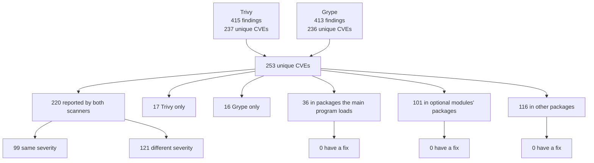
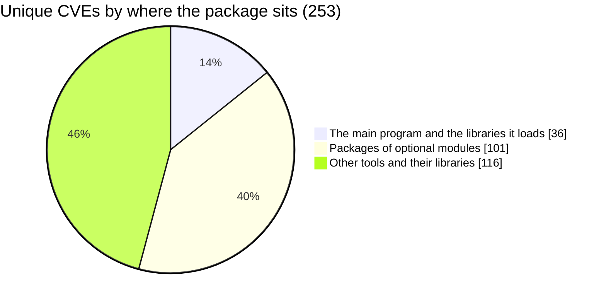
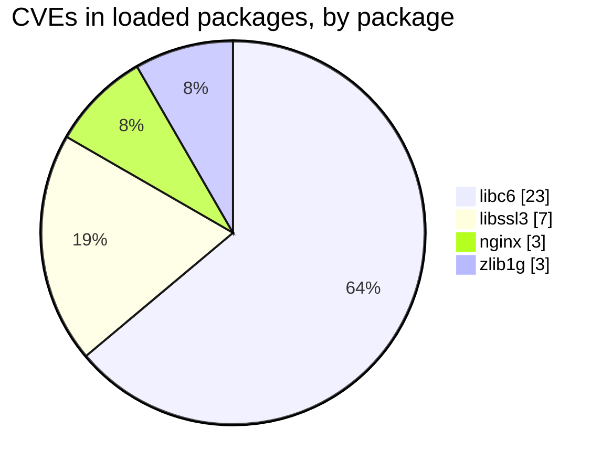
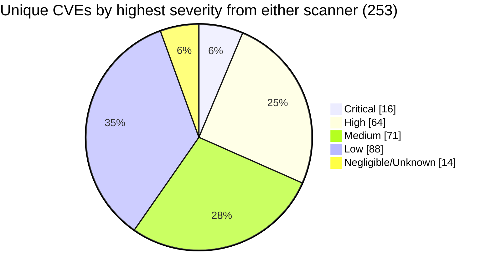
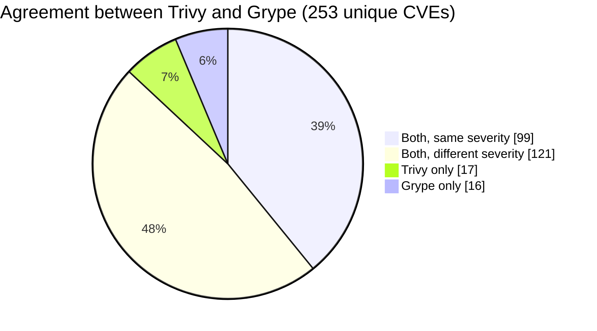
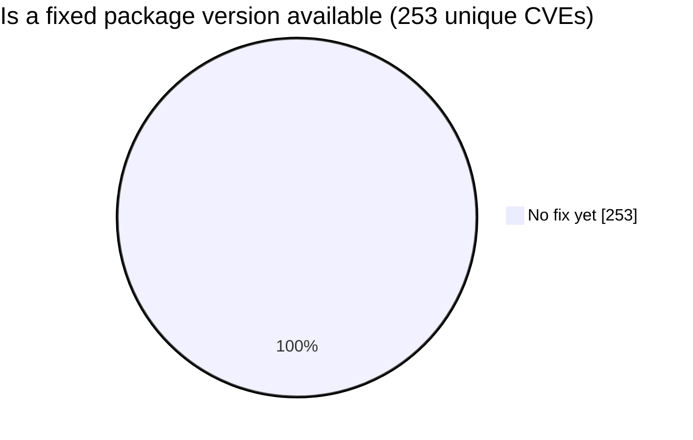

# Scan statistics

Generated by `scripts/compare-scans.py` from `trivy.json` and `grype.json`. Do not edit by
hand; rerun the script. Counts are unique CVEs unless a line says "findings". GitHub
renders the diagrams; in a plain text editor they appear as code.

## How the 253 break down

## Where the vulnerabilities live

## How severe

Findings per scanner (the same CVE in two packages counts twice):

| Severity | Trivy | Grype |
|---|---|---|
| Critical | 3 | 22 |
| High | 82 | 104 |
| Medium | 159 | 123 |
| Low | 155 | 20 |
| Negligible | 0 | 126 |
| Unknown | 16 | 18 |
| **Total findings** | **415** | **413** |

## Do the scanners agree

2 CVEs are Critical in both scanners.

## Can it be fixed by updating

## How likely to be exploited

| Signal | Unique CVEs |
|---|---|
| On CISA's known-exploited list (KEV) | 1 (CVE-2023-44487 in `nginx`) |
| EPSS of 10% or more | 3 |
| EPSS of 1% or more | 33 |
| EPSS below 1% | 220 |

## Optional modules

Packages installed only because of each module. Counts overlap where two
modules share a package; together they account for 101.

| Module | Packages it brings in | CVEs in them | Critical or High | With a fix |
|---|---|---|---|---|
| `nginx-module-image-filter` | 32 | 89 | 25 | 0 |
| `nginx-module-xslt` | 3 | 12 | 7 | 0 |
| `nginx-module-njs` | 4 | 9 | 7 | 0 |
| `nginx-module-geoip` | 1 | 0 | 0 | 0 |

## Packages with the most CVEs

| Package | Unique CVEs | Critical or High | Loaded by the main program |
|---|---|---|---|
| `libheif1` | 42 | 16 | No |
| `curl` | 26 | 14 | No |
| `libcurl4` | 26 | 14 | No |
| `libtiff6` | 24 | 4 | No |
| `libc-bin` | 23 | 4 | No |
| `libc6` | 23 | 4 | Yes |
| `perl-base` | 18 | 12 | No |
| `bsdutils` | 11 | 5 | No |
| `util-linux-extra` | 11 | 5 | No |
| `libblkid1` | 11 | 5 | No |
| `libsmartcols1` | 11 | 5 | No |
| `libuuid1` | 11 | 5 | No |
